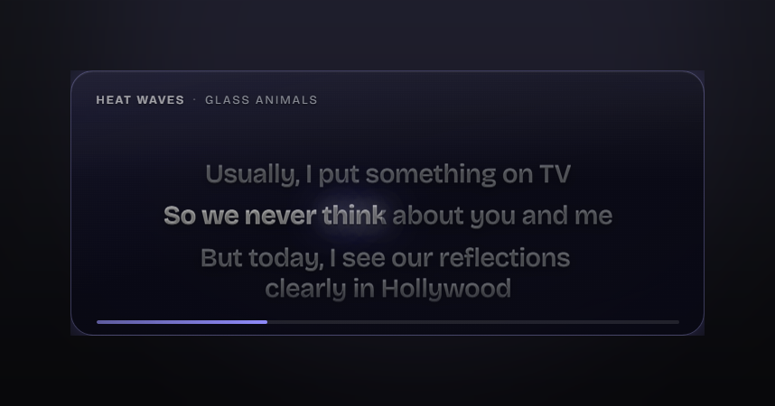
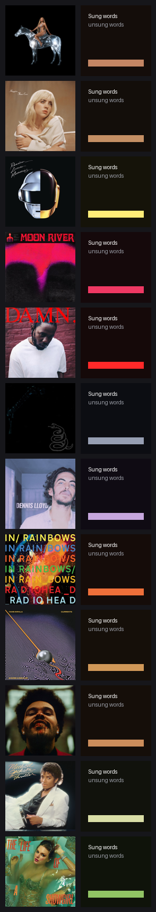
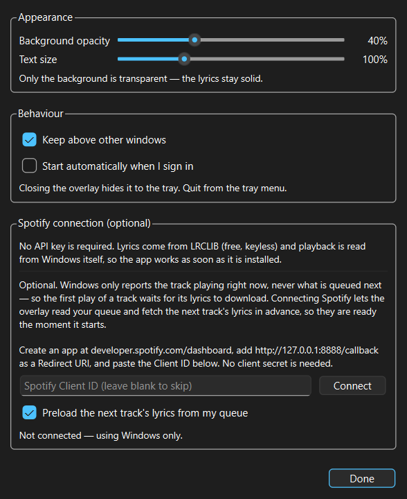
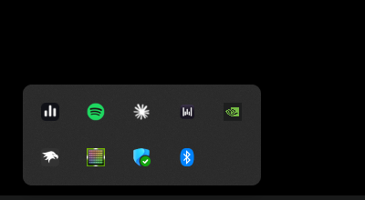

# Spotify Lyrics Overlay for Windows

**A transparent, always-on-top desktop overlay that shows synced Spotify lyrics, highlighted word by word as the song plays.** Free, no API key, no account — download it and it works.



<p align="center">
  <a href="https://github.com/viraj-rgb/spotify-lyrics-overlay/releases/latest">
    <b>⬇ Download for Windows</b>
  </a>
</p>

---

## What it does

- **Floating lyrics on your desktop** — a transparent card that stays above other windows, over any app or game.
- **Word-by-word highlighting** — each word lights up as it is sung, karaoke style, not just line by line.
- **Colours match the album cover** — the card is tinted from the artwork of whatever is playing, and crossfades when the track changes.
- **Reads Spotify automatically** — no login, no Spotify Developer account, no API key. It uses the same Windows media info that powers the volume flyout.
- **Drag it anywhere, resize it** — grab any edge or corner. Position and size are remembered.
- **Lives in the system tray** — click the icon to show or hide. It stays out of the taskbar and Alt-Tab, so it behaves like an overlay, not an app you switch to.

## Download

**[⬇ Get the latest release](https://github.com/viraj-rgb/spotify-lyrics-overlay/releases/latest)**

1. Download the `.zip` from the Releases page.
2. Unzip it anywhere.
3. Run `SpotifyLyricsOverlay.exe`.

No installer, no Python needed, nothing to configure. Start Spotify and play something.

> Windows SmartScreen may warn about an unrecognised app, because the build is not code-signed (a signing certificate costs money). Click **More info → Run anyway**, or [run it from source](#run-from-source) instead if you would rather not.

## Album colours

The card takes its colour from the cover of whatever is playing — the plate tint, the glow on the sung words, the progress bar and the aura around the edge.



The artwork only ever supplies a **hue**. Lightness is forced dark and the text stays solid white and grey, so a pale or garish cover can never make the lyrics hard to read. Black-and-white covers fall back to a neutral theme rather than having a colour invented for them.

## Settings

Right-click the tray icon → **Settings**.



| | |
|---|---|
| **Background opacity** | How see-through the card is. Only the background — the lyrics always stay solid. |
| **Text size** | Scales the lyric type. |
| **Tint from album cover** | Turn album colouring on or off. |
| **Keep above other windows** | Always-on-top. |
| **Start automatically** | Launch when you sign in to Windows. |

## In the tray



Click the icon to show or hide the overlay. Right-click for Settings and Quit. Closing the card with `×` hides it to the tray rather than quitting, so a stray click cannot make it disappear.

## Do I need a Spotify API key?

**No.** Nothing here needs credentials:

- **Lyrics** come from [LRCLIB](https://lrclib.net), which is free and keyless.
- **What's playing** comes from Windows itself, so there is no login and no network request to read the current track.

There is one **optional** extra. Windows only reports the song playing *right now*, never what is queued next — so the first play of a track waits a moment for its lyrics to download. If you paste your own Spotify **Client ID** into Settings, the overlay can read your queue and fetch the next track's lyrics in advance, so they are ready the instant it starts. Leave it blank and everything else works exactly the same.

To set that up: create an app at [developer.spotify.com/dashboard](https://developer.spotify.com/dashboard), add `http://127.0.0.1:8888/callback` as a Redirect URI, and paste the Client ID. There is no client secret, so the app can be shared freely and each person uses their own ID.

## About the word timing

Lyrics from LRCLIB are **line**-synced: every line carries one timestamp. True per-word timing — the kind behind Spotify's own karaoke view — comes from a paid commercial provider and has no free equivalent.

So the word timings here are **derived**: each line's duration is distributed across its words by length. In practice it reads as karaoke and stays close to the vocal, because the sweep uses the whole window between one line and the next, and the singing pace is measured *per track* — a fast rap verse and a slow ballad differ by more than three times, and any fixed guess gets one of them wrong. Lines followed by an instrumental break are detected so the highlight finishes and waits instead of crawling through silence.

What it cannot know is phrasing inside a line: a held syllable or a mid-line pause will drift for a beat before the next line snaps it back.

## Requirements

- Windows 10 or 11
- The Spotify **desktop app** running (that is where Windows gets the track info)
- An internet connection, for looking up lyrics

Lyrics are cached, so replaying a song works offline.

## Run from source

```bat
git clone https://github.com/viraj-rgb/spotify-lyrics-overlay.git
cd spotify-lyrics-overlay
pip install -r requirements.txt
python install.py
```

`install.py` puts a shortcut on your Desktop and in the Start Menu. Or just run `python launch.py`.

`python install.py --uninstall` removes the shortcuts.

## How it works

```
Spotify desktop app
      |  Windows SMTC — the same source as the media flyout
      v
   app/smtc.py     track, artist, playhead, album art
      |
      v
  app/lyrics.py    LRCLIB lookup, LRC parsing, word timing
  app/palette.py   colour theme extracted from the cover
      |
      v
   app/main.py     transparent, frameless Qt window
      |
      v
     web/          renders and animates the card
```

The window is a frameless translucent Qt shell whose entire visible surface is a web view. Qt owns the window — transparency, stacking, dragging, resizing — and the web layer owns everything you can see.

The playhead needs care: Windows reports position as a snapshot plus the time it was taken, so it is corrected for staleness, and the web layer runs its own clock between polls. That is what lets the highlight move at full frame rate rather than stepping a few times a second.

## Privacy

Everything runs locally. The only network requests are lyric lookups to LRCLIB, and — if you choose to connect it — Spotify's own API. No analytics, no telemetry, nothing is uploaded.

## Licence

MIT — see [LICENSE](LICENSE).

Lyrics are provided by [LRCLIB](https://lrclib.net). This project is not affiliated with, endorsed by, or connected to Spotify AB.

---

<sub>Keywords: spotify lyrics overlay windows · floating lyrics desktop app · transparent always on top lyrics · word by word synced lyrics · karaoke lyrics overlay for pc · spotify desktop lyrics free · real-time synced lyrics windows 10 11</sub>
